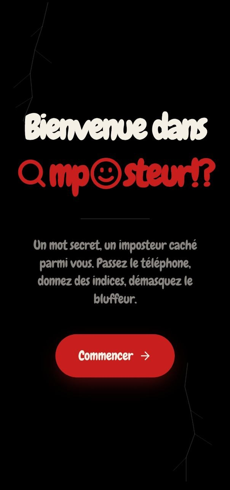
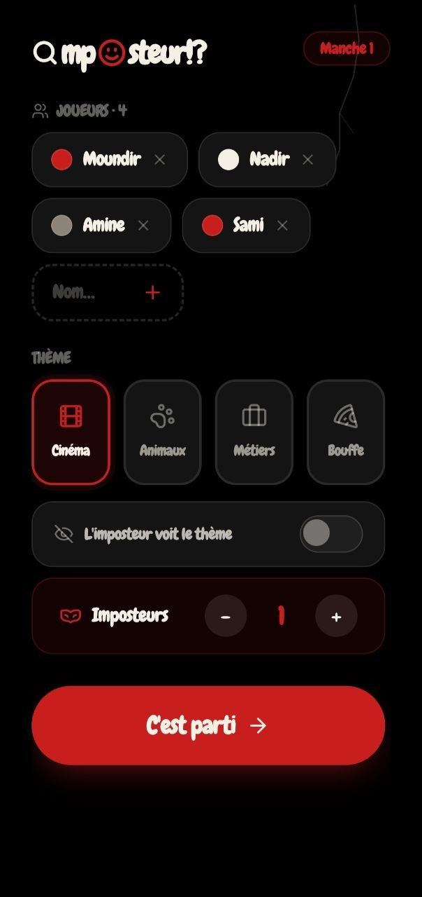
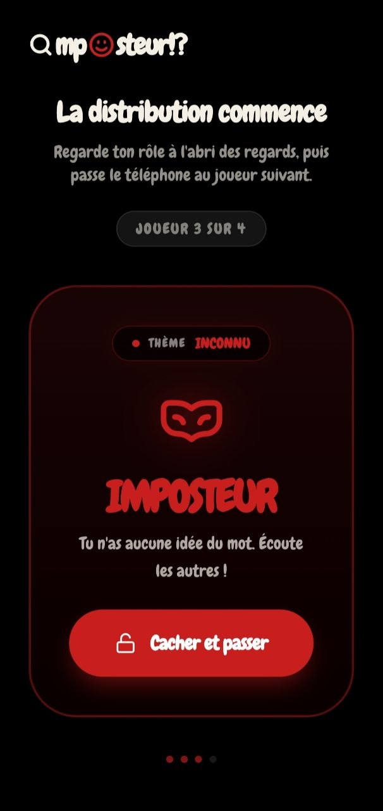
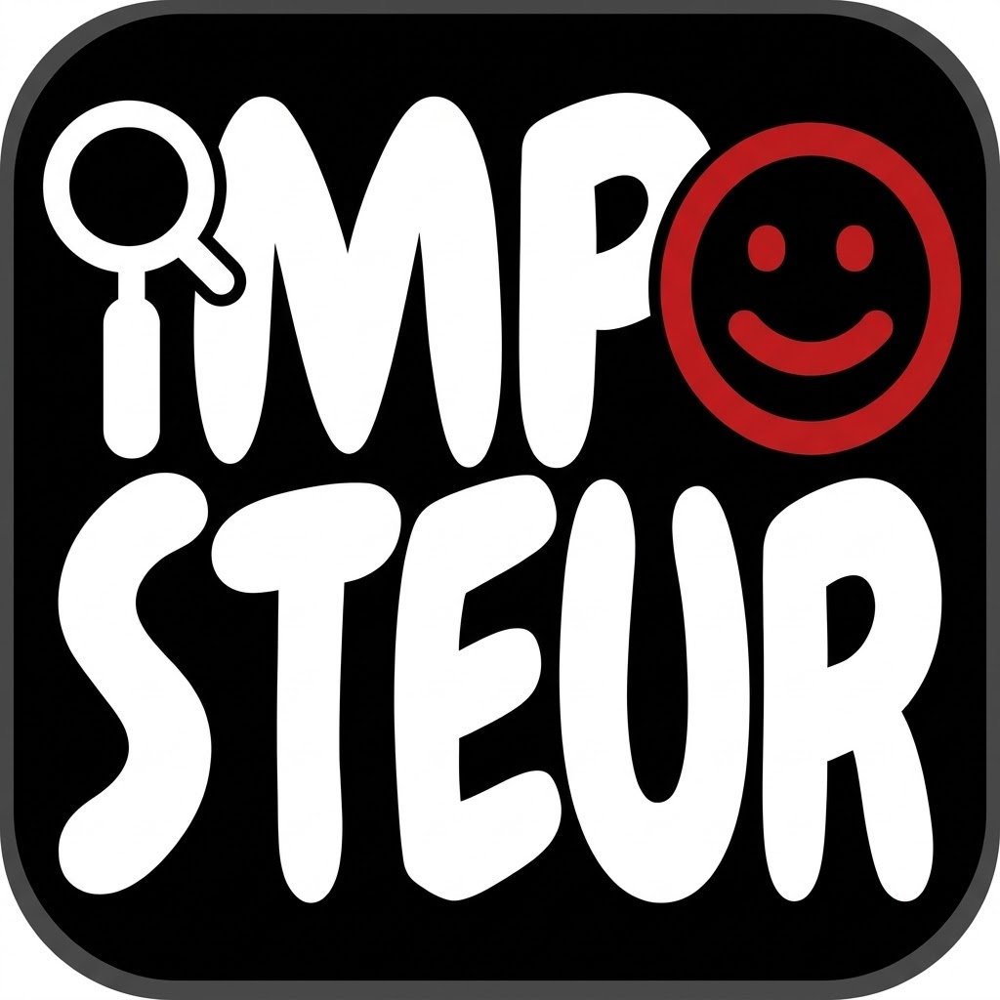

<p align="center">
  
  
  
</p>

<h1 align="center"> </h1>

<p align="center">
  <strong>Un mot pour tous. Un silence pour celui qui bluffe.</strong><br/>
  Jeu de société façon "pass & play" — 100% front, sans compte, sans base de données, joué en se passant un seul téléphone entre amis.
</p>

<p align="center">
  
  
  
  
  
  
</p>

---

## Sommaire

- [À propos](#à-propos)
- [Comment on joue](#comment-on-joue)
- [Fonctionnalités](#fonctionnalités)
- [Stack technique](#stack-technique)
- [Structure du projet](#structure-du-projet)
- [Installation](#installation)
- [Thèmes et mots](#thèmes-et-mots)
- [Design System](#design-system)
- [Déploiement](#déploiement)
- [Feuille de route](#feuille-de-route)

---

## À propos

**Imposteur** est un jeu de société numérique inspiré des jeux de bluff façon "loup-garou" / "Skull" : tous les joueurs reçoivent le même mot secret, sauf un (ou plusieurs) imposteur(s) qui n'en sait rien — ou parfois seulement le thème, selon les réglages. Chacun donne un indice à voix haute pour prouver qu'il connaît le mot sans le dire, puis le groupe vote pour démasquer le bluffeur.

Pas de compte, pas de serveur, pas de base de données : toute la logique — répartition des rôles, ordre de passage, dépouillement des votes — tourne entièrement côté client, en mémoire, le temps d'une manche.

## Comment on joue

1. **Accueil** — écran de bienvenue qui présente le jeu
2. **Préparation** — on ajoute les joueurs, on choisit un thème, le nombre d'imposteurs, et si l'imposteur a le droit de voir le thème ou non
3. **Distribution** — un ordre de passage est tiré au sort à chaque manche ; chaque joueur, à son tour, retourne une carte confidentielle pour découvrir son rôle (le mot secret, ou "Imposteur")
4. **Discussion** — chacun donne un indice, dans l'ordre tiré au sort
5. **Vote** — toujours dans le même ordre, chaque joueur désigne en privé le suspect qu'il accuse
6. **Verdict** — dépouillement animé, révélation du joueur démasqué, et annonce du camp vainqueur (les innocents s'ils ont trouvé l'imposteur, l'imposteur sinon)

## Fonctionnalités

- 🎲 **Ordre de passage aléatoire** à chaque manche (tirage de Fisher-Yates), réutilisé pour la distribution des rôles, la discussion et le vote
- 🃏 **Distribution façon carte confidentielle** avec flip 3D (recto verrouillé, verso qui révèle le rôle)
- 👁️ **Option "l'imposteur voit le thème"** — réglable via un switch, pour ajuster la difficulté
- 🗳️ **Vote tour par tour** — chaque joueur vote en privé (le téléphone circule entre chaque vote), pas de vote à voix haute qui influence les autres
- 📊 **Dépouillement animé** — barres de votes qui se remplissent progressivement, verdict dramatisé avec animation de révélation
- 🎭 **Thèmes locaux** — cinéma algérien, faune du Sahara et de l'Atlas, métiers du quotidien, cuisine traditionnelle, personnages célèbres
- 🌓 **Design cohérent** — même identité visuelle (logo, couleurs, police) sur les quatre écrans du jeu
- 📱 **100% responsive** — pensé mobile d'abord (le format du jeu, un téléphone qui circule), sans jamais nécessiter de scroll pour accéder aux actions principales

## Stack technique

**Frontend**
- React (Vite)
- Tailwind CSS v4 (`@tailwindcss/vite`, configuration via `@theme` dans le CSS)
- Framer Motion (animations, transitions d'écran, flip 3D des cartes)
- lucide-react (icônes)
- Police `Chewy` (Google Fonts) — utilisée pour l'intégralité des textes de l'interface

**Aucun backend, aucune base de données** — toute la donnée (joueurs, rôles, votes) vit dans le `state` React le temps d'une partie et disparaît à la fin.

## Structure du projet

```
imposteur/
├── public/
│   ├── 1.jpg              # Capture — écran d'accueil
│   ├── 2.jpg              # Capture — préparation de partie
│   └── 3.jpg              # Capture — écran de vote
└── src/
    ├── components/
    │   ├── Setupscreen.jsx   # Écran d'accueil + formulaire de préparation
    │   ├── GameScreen.jsx    # Distribution des rôles (cartes flip 3D)
    │   └── Votescreen.jsx    # Vote tour par tour + verdict
    ├── App.jsx               # Orchestration des écrans (setup → game → vote)
    ├── index.css             # Import Tailwind + thème (polices, couleurs)
    └── main.jsx
```

## Installation

```bash
git clone https://github.com/Moundirbechikh/IMPOSTEUR.git
cd IMPOSTEUR
npm install
npm run dev
```

Le site démarre par défaut sur `http://localhost:5173`.

Aucune variable d'environnement n'est nécessaire : le projet est entièrement statique, sans appel réseau, sans clé d'API.

## Thèmes et mots

Les mots sont répartis par thème dans `src/components/GameScreen.jsx` (objet `WORDS`) :

| Thème | Contenu |
|---|---|
| 🎬 Cinéma | Films algériens et maghrébins marquants |
| 🐾 Animaux | Faune du Sahara, des hauts plateaux et de l'Atlas |
| 👷 Métiers | Métiers courants du quotidien algérien |
| 🍽️ Bouffe | Plats traditionnels algériens |
| 🎭 Personnages | Figures culturelles, historiques et sportives algériennes |

Chaque thème peut être étendu simplement en ajoutant des mots dans son tableau — aucune limite technique de taille.

## Design System

| Élément | Valeur |
|---|---|
| Police (unique, tout le site) | `Chewy` (Google Fonts) |
| Fond principal | `#000000` (noir) |
| Texte | `#F5F0E6` (blanc cassé / papier) |
| Couleur d'accent | `#C81E1E` (rouge sceau) |
| Coins arrondis | `rounded-2xl` / `rounded-full` (boutons, pilules) |
| Détail signature | fissures SVG discrètes façon statue craquelée, générées aléatoirement en fond |
| Logo | mot-symbole `🔍mp😊steur!?` — loupe à la place du "I", smiley rouge à la place du "O" |
| Bibliothèque d'icônes | [lucide-react](https://lucide.dev) uniquement |

## Déploiement

### Frontend → Vercel
Déploie le dépôt directement. Aucune configuration particulière n'est requise au-delà du build Vite standard :

```bash
npm run build
```

Un fichier `vercel.json` n'est pas nécessaire ici (pas de routes React Router côté client à réécrire), sauf si un routage est ajouté plus tard.

## Feuille de route

- [ ] Support de plusieurs manches consécutives avec score cumulé
- [ ] Écran de discussion avec ordre de passage affiché explicitement
- [ ] Gestion des égalités de votes (actuellement, le premier suspect à égalité est retenu)
- [ ] Ajout de nouveaux thèmes (musique, géographie, personnages internationaux)
- [ ] Sauvegarde locale (localStorage) de la liste de joueurs favorite

---

<p align="center">
  <sub>Construit avec React, Vite et beaucoup de café ☕</sub>
</p>